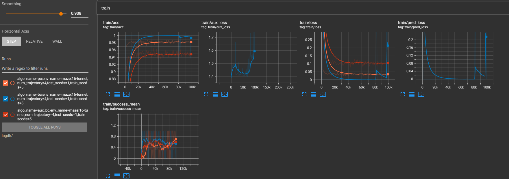
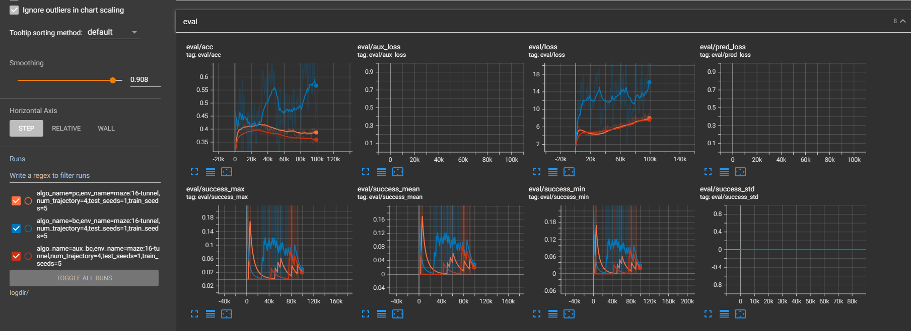

# Chain of thought Imitation with Procedure Cloning (Pytorch Version)

This repository contains pytorch code for ``Chain of Thought Imitation with Procedure Cloning''.

Please cite this work upon using this library.

## Setup

Install the discrete maze environment:

    cd dice_rl
    pip install -e ./dice_rl

## Run procedure cloning

Run procedure cloning with default maze size:

    source run_train_eval.sh

Change `algo_name` in `run_train_eval.sh` from `pc` (procedure cloning) to `bc` (vanilla behavioral cloning).

## Create additional datasets
To test procecure cloning on addition datasets (e.g., maze of different sizes), create data by changing `create_dataset.sh` and create more discrete maze data:

    source create_dataset.sh

## Tensorboard Results

